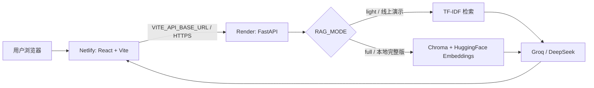
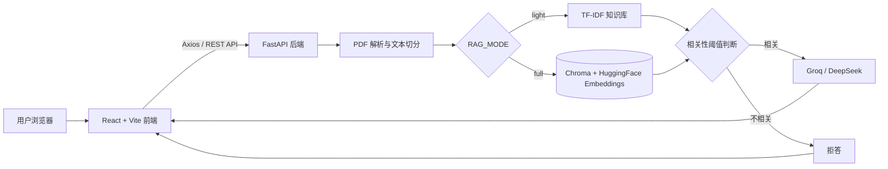

# AutoCourse-RAG

面向自动化课程资料的智能问答与学习辅助系统

## 项目简介

AutoCourse-RAG 是一个采用 React + FastAPI 前后端分离架构的课程资料 RAG（Retrieval-Augmented Generation）应用。用户可以上传多份自动化课程 PDF，构建本地向量知识库，并通过 Groq 或 DeepSeek 模型完成课程问答、来源追溯、课程总结、知识点提取和复习题生成。

系统将大模型回答限制在课程资料检索结果内，并通过距离阈值拒绝相关性不足的问题，降低脱离资料生成内容的风险。项目同时保留原有 Streamlit 版本，便于对比单体应用与前后端分离架构的实现方式。

## 在线体验

- React 前端（Netlify）：[https://autocourse-rag.netlify.app](https://autocourse-rag.netlify.app/)
- FastAPI 健康检查（Render）：[https://autocourse-rag-backend.onrender.com/health](https://autocourse-rag-backend.onrender.com/health)

> 当前线上服务为免费演示版。Render Free 实例可能休眠，首次访问或首次请求需要等待服务唤醒。

## 部署架构

- React + Vite 前端部署在 Netlify，通过 `VITE_API_BASE_URL` 连接 Render 后端。
- FastAPI 后端部署在 Render，通过 RESTful API 提供 PDF 上传、RAG 问答、学习辅助和知识库重置能力。
- DeepSeek 与 Groq API Key 仅通过后端环境变量管理，不写入前端代码或构建产物。
- 线上演示使用 `RAG_MODE=light`，通过 TF-IDF 完成低内存检索；本地可切换为 `RAG_MODE=full` 使用 Chroma + HuggingFace Embeddings。



## 免费演示版说明

- Render Free 实例可能自动休眠，首次访问时响应速度可能较慢。
- 当前线上后端使用 `RAG_MODE=light`，避免 Chroma、Sentence Transformers 和 PyTorch 超出免费实例内存限制。
- 上传的 PDF 和生成的知识库保存在免费实例的临时存储中，不保证长期持久保存。
- 服务重启或数据丢失后，用户可以重新上传 PDF 并构建知识库。
- 本地完整版仍支持 `RAG_MODE=full`，使用 Chroma + HuggingFace Embeddings 完成向量检索。

## 技术栈

| 层级 | 技术 |
| --- | --- |
| 前端 | HTML、CSS、JavaScript、React、Vite |
| 前端通信 | Axios、FormData、RESTful API |
| 后端 | Python、FastAPI、Uvicorn、Pydantic、CORS |
| RAG 框架 | LangChain、LangChain Community、full / light 双模式 |
| 文档处理 | PyPDF、RecursiveCharacterTextSplitter |
| 检索与向量化 | TF-IDF、Scikit-learn、HuggingFace Embeddings、Sentence Transformers |
| 知识库存储 | 轻量内存知识库、Chroma |
| 大模型服务 | Groq API、DeepSeek API、OpenAI-compatible API |
| 部署 | Netlify、Render Free Web Service |
| 测试 | unittest、FastAPI TestClient、Vitest、Testing Library |

## 系统架构



本地完整版处理链路：

```text
多 PDF 上传
  → PDF 文本解析
  → chunk 切分
  → HuggingFace Embedding
  → Chroma 持久化
  → similarity_search_with_score
  → 距离阈值判断
  → 大模型生成回答
  → 来源文件、页码、距离分数和参考片段展示
```

线上轻量版保留相同的上传、问答、拒答和来源追溯接口，将 Embedding + Chroma 检索替换为 TF-IDF + 余弦相似度检索，以适配 Render Free 的内存限制。

## 核心功能

- 支持一次上传多份 PDF，并统一构建课程知识库。
- 对每个文档执行文本解析、chunk 切分和本地 Embedding 向量化。
- 使用 Chroma 持久化存储向量，并通过 `similarity_search_with_score` 完成语义检索。
- 返回来源文件、页码、距离分数和参考片段，提供回答追溯能力。
- 根据 Chroma 距离值执行阈值判断，相关性不足时不调用大模型并直接拒答。
- 支持 Groq / DeepSeek 双模型切换，复用统一的大模型调用封装。
- 基于当前知识库生成课程总结、核心知识点和复习题。
- 支持清空 PDF 文件和向量库，并使用新资料重新构建知识库。
- 支持 `full` / `light` 双模式，在本地检索能力和免费云部署资源限制之间进行适配。

## 前端功能

前端使用 Vite + React + JavaScript 构建，采用原生 CSS 实现组件化页面、交互状态展示和基础响应式布局。

- 使用 `Sidebar`、`UploadPanel`、`ChatPanel`、`SourceCard`、`StudyTools` 等组件拆分页面职责。
- 通过 Axios 统一封装健康检查、上传、问答、学习辅助和知识库重置请求。
- 支持拖拽或选择多份 PDF，并通过 `FormData` 上传至 FastAPI。
- 支持 Groq / DeepSeek 模型选择和检索片段数量调整。
- 展示请求 loading、接口错误、拒答、知识库状态和构建结果。
- 使用可折叠来源卡片收纳参考内容，避免长文本影响页面浏览。
- 在知识库清空或重建后同步刷新状态，并清除旧知识库对应的页面结果。
- 提供桌面双栏、平板和移动端单栏布局，无需引入复杂 UI 框架。

## 后端 API

FastAPI 提供以下接口，默认服务地址为 `http://localhost:8000`，交互式接口文档位于 `/docs`。

| 方法 | 路径 | 说明 | 主要请求数据 |
| --- | --- | --- | --- |
| `GET` | `/health` | 获取服务与知识库状态 | 无 |
| `POST` | `/upload` | 上传多份 PDF 并重建知识库 | `multipart/form-data`：`files` |
| `POST` | `/ask` | 执行检索、阈值判断和问答 | `question`、`model_provider`、`top_k` |
| `POST` | `/study/summary` | 生成课程总结 | `model_provider` |
| `POST` | `/study/knowledge-points` | 提取核心知识点 | `model_provider` |
| `POST` | `/study/quiz` | 生成复习题和参考答案 | `model_provider` |
| `POST` | `/reset` | 清空后端 PDF 与当前模式知识库 | 无 |

`POST /ask` 返回示例：

```json
{
  "answer": "基于课程资料生成的回答",
  "sources": [
    {
      "source": "course.pdf",
      "page": 3,
      "score": 9.25,
      "content": "用于生成回答的参考片段"
    }
  ],
  "is_refused": false
}
```

## 项目结构

```text
AutoCourse-RAG/
├── backend/
│   ├── __init__.py
│   ├── main.py                 # FastAPI 应用、请求模型和 REST API
│   ├── rag_core.py             # PDF 处理、向量库、检索与拒答逻辑
│   ├── light_rag_core.py       # Render Free 使用的 TF-IDF 轻量检索
│   ├── llm_client.py           # Groq / DeepSeek 统一调用封装
│   ├── requirements.txt        # Render 轻量版依赖
│   ├── requirements-full.txt   # 本地完整版附加依赖
│   ├── runtime.txt             # Render Python 运行版本
│   └── test_main.py            # FastAPI 接口测试
├── frontend/
│   ├── src/
│   │   ├── components/
│   │   │   ├── Sidebar.jsx
│   │   │   ├── UploadPanel.jsx
│   │   │   ├── ChatPanel.jsx
│   │   │   ├── SourceCard.jsx
│   │   │   └── StudyTools.jsx
│   │   ├── api.js              # Axios 接口封装
│   │   ├── App.jsx             # 前端状态管理与页面组合
│   │   ├── main.jsx            # React 入口
│   │   └── styles.css          # 原生 CSS 与响应式样式
│   ├── netlify.toml             # Netlify 构建与发布目录配置
│   ├── package.json
│   └── vite.config.js          # Vite 配置与开发代理
├── app.py                      # 保留的 Streamlit 版本
├── rag_core.py                 # Streamlit 版本 RAG 核心模块
├── llm_client.py               # Streamlit 版本模型调用模块
├── test_rag_core.py            # RAG 核心测试
├── requirements.txt            # Streamlit 版本依赖
├── screenshots/                # README 功能截图
├── .gitignore
└── README.md
```

运行时会生成以下目录，且不应提交到 Git：

```text
backend/data/        # FastAPI 后端保存的 PDF
backend/vector_db/   # FastAPI 后端 Chroma 数据
frontend/node_modules/
frontend/dist/
```

## 环境变量配置

后端环境变量：

```env
GROQ_API_KEY=你的Groq密钥
DEEPSEEK_API_KEY=你的DeepSeek密钥
FRONTEND_ORIGIN=http://localhost:5173
RAG_MODE=full
```

`RAG_MODE` 可设置为：

- `full`：本地完整版，使用 Chroma + HuggingFace Embeddings。
- `light`：低内存版本，使用 TF-IDF 检索，适合 Render Free 线上演示。

`FRONTEND_ORIGIN` 用于配置 FastAPI CORS 允许的前端来源。不要在代码中写死密钥，也不要将 `.env` 提交到 GitHub。

前端环境变量：

```env
VITE_API_BASE_URL=https://your-api.example.com
```

本地未配置时，开发环境默认连接 `http://localhost:8000`。Netlify 生产环境通过站点环境变量连接 Render 后端。前端只保存公开的 API 服务地址，不配置 DeepSeek 或 Groq API Key。

## 后端运行方式

建议使用 Python 虚拟环境：

```bash
python -m venv venv
```

安装 FastAPI 后端依赖：

```bash
pip install -r backend/requirements.txt
```

启动后端：

```bash
python -m uvicorn backend.main:app --reload --port 8000
```

启动后可访问：

- 健康检查：`http://localhost:8000/health`
- Swagger API 文档：`http://localhost:8000/docs`

## 前端运行方式

安装 Node.js 依赖：

```bash
cd frontend
npm install
```

启动 React 开发服务器：

```bash
npm run dev
```

浏览器访问 `http://localhost:5173`。生产构建命令：

```bash
npm run build
```

## 功能截图

以下截图基于 React + FastAPI 版本和 3 份自动控制课程测试资料生成，重点展示 PDF 上传、RAG 问答、来源追溯、学习工具和响应式页面。

### 学习工作台首页


### 多 PDF 上传与知识库管理


### RAG 智能问答


### 来源追溯与距离分数


### 学习辅助


### 移动端响应式布局


## 项目亮点

- **React 组件化开发**：按上传、问答、来源和学习辅助等职责拆分组件，通过 Props 与状态组合完整页面。
- **原生 Web 页面实现**：使用 HTML、CSS 和 JavaScript 完成 PDF 上传、模型选择、问答工作区、来源追溯和学习工具展示，不依赖复杂 UI 框架。
- **前后端分离**：React 通过 Axios 调用 FastAPI RESTful API，接口职责和数据模型清晰。
- **完整 RAG 链路**：覆盖 PDF 解析、chunk 切分、Embedding、Chroma 持久化、语义检索、阈值判断和回答生成。
- **多文档知识库**：支持多份课程资料统一向量化，并保留每个 chunk 的来源文件和页码信息。
- **可解释与低幻觉设计**：展示检索距离和参考片段，相关性不足时跳过大模型调用并直接拒答。
- **双模型接入**：通过统一客户端封装 Groq 和 OpenAI-compatible DeepSeek API，前端可直接切换模型服务。
- **双模式 RAG 架构**：本地 `full` 模式使用 Chroma + HuggingFace Embeddings，线上 `light` 模式使用 TF-IDF，在保持接口一致的同时适配不同运行资源。
- **免费云部署适配**：React + Vite 部署到 Netlify，FastAPI 部署到 Render Free，并通过环境变量管理跨域来源、RAG 模式和服务地址。
- **垂直场景落地**：围绕自动控制、PLC、传感器、电机控制等自动化课程资料提供问答和学习辅助能力。
- **新旧架构并存**：保留 Streamlit 实现，同时提供 React + FastAPI 版本，展示从快速原型到前后端分离应用的演进过程。

## 当前不足与后续优化

- 暂未集成 OCR，扫描版或无文本层 PDF 无法直接构建知识库。
- 当前采用基础向量相似度检索，后续可加入关键词混合检索和 Cross-Encoder 重排序。
- 距离阈值目前基于当前 Embedding 与课程资料设定，后续可通过检索评估数据进行校准。
- 学习辅助功能使用有限数量的代表性 chunk，后续可增加分层摘要和 Map-Reduce 总结。
- 暂未实现用户登录、知识库隔离和多知识库管理。
- 暂未支持多轮对话记忆，当前每次问答独立执行检索。
- 免费演示版不提供持久化磁盘，实例重启后可能需要重新上传课程资料。
- 后续可增加检索指标评估、自动化端到端测试、容器化部署和持续集成。
