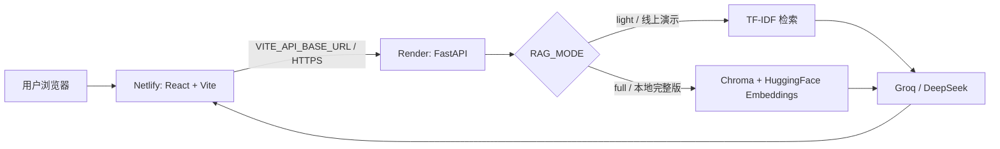
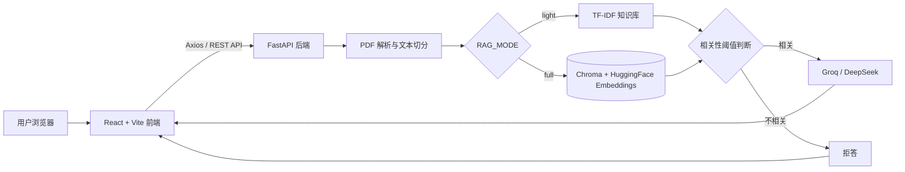
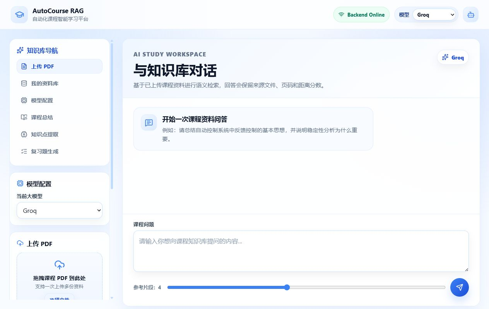
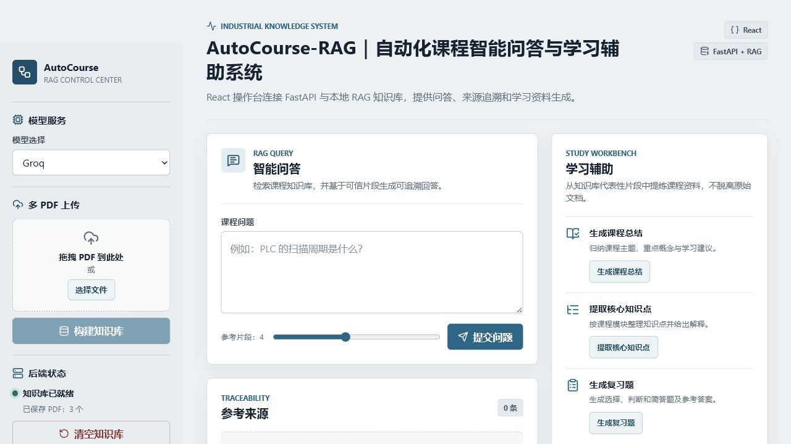
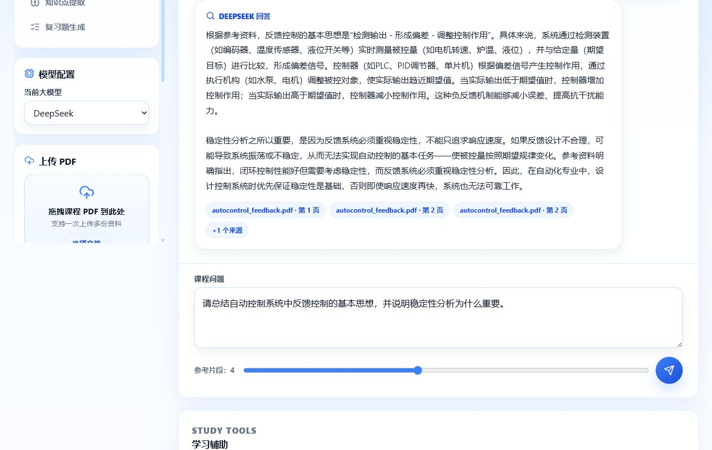
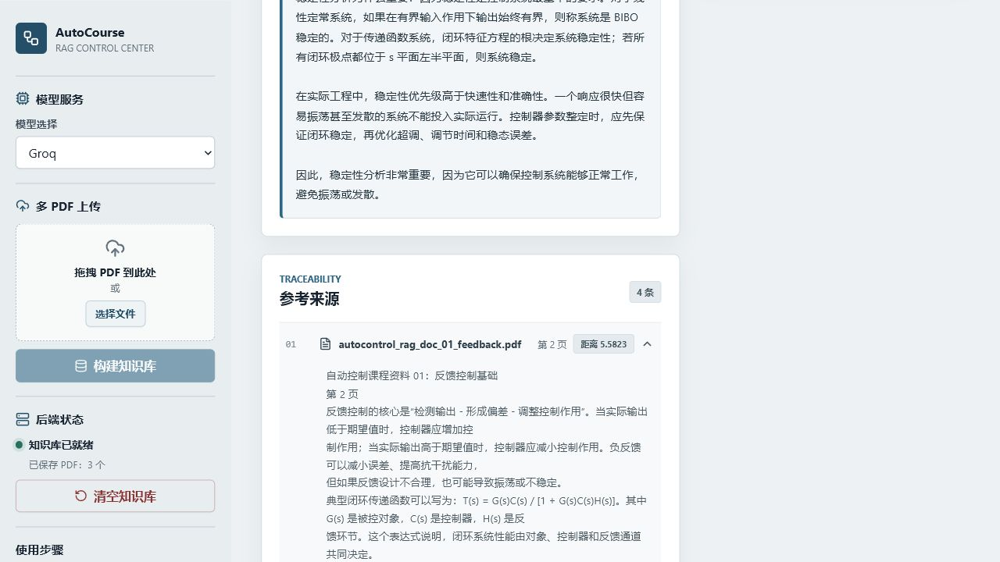
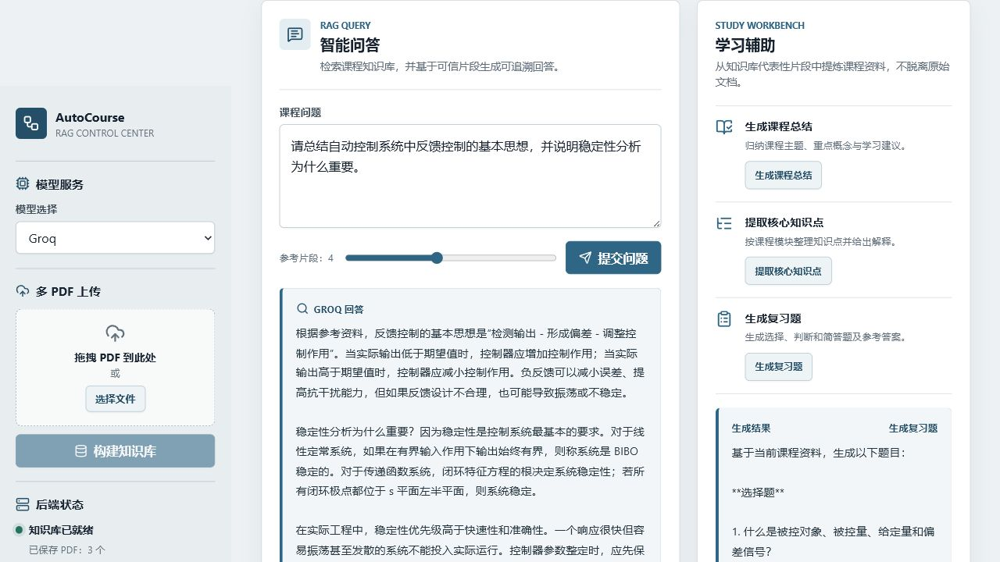
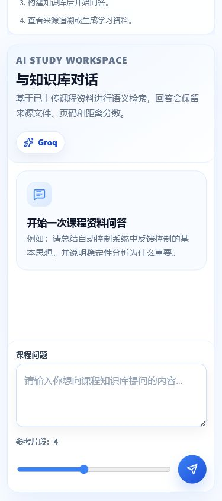

# 基于 RAG 的自动化课程智能学习平台

## 项目简介

基于 RAG 的自动化课程智能学习平台是一个采用 React + FastAPI 前后端分离架构的课程资料 RAG（Retrieval-Augmented Generation）应用。用户可以上传多份自动化课程 PDF，构建本地向量知识库，并通过 Groq 或 DeepSeek 模型完成多轮课程问答、来源追溯、课程总结、知识点提取和复习题生成。

系统将大模型回答限制在课程资料检索结果内，并通过距离阈值拒绝相关性不足的问题，降低脱离资料生成内容的风险。项目同时保留原有 Streamlit 版本，便于对比单体应用与前后端分离架构的实现方式。

## 在线体验

- React 前端（Netlify）：[https://autocourse-rag.netlify.app](https://autocourse-rag.netlify.app/)
- FastAPI 后端（Render）：[https://autocourse-rag-backend.onrender.com](https://autocourse-rag-backend.onrender.com/)
- FastAPI 健康检查（Render）：[https://autocourse-rag-backend.onrender.com/health](https://autocourse-rag-backend.onrender.com/health)
- Swagger API 文档：[https://autocourse-rag-backend.onrender.com/docs](https://autocourse-rag-backend.onrender.com/docs)

> 当前线上服务为免费演示版。Render Free 实例可能休眠，首次访问或首次请求需要等待服务唤醒。

## 在线部署

- React + Vite 前端部署在 Netlify，通过 `VITE_API_BASE_URL` 连接 Render 后端。
- FastAPI 后端部署在 Render，通过 RESTful API 提供 PDF 上传、RAG 问答、学习辅助和知识库重置能力。
- DeepSeek 与 Groq API Key 仅通过后端环境变量管理，不写入前端代码或构建产物。
- 线上演示使用 `RAG_MODE=light`，通过 TF-IDF 完成低内存检索；本地可切换为 `RAG_MODE=full` 使用 Chroma + HuggingFace Embeddings。



## 免费演示版说明

- Render Free 实例可能自动休眠，首次访问时响应速度可能较慢。
- 当前线上后端使用 `RAG_MODE=light`，避免 Chroma、Sentence Transformers 和 PyTorch 超出免费实例内存限制。
- 上传的 PDF 和生成的知识库保存在免费实例的临时存储中，不保证长期持久保存。
- 服务重启或数据丢失后，用户可以重新上传 PDF 并构建知识库。
- 本地完整版仍支持 `RAG_MODE=full`，使用 Chroma + HuggingFace Embeddings 完成向量检索。

## 技术栈

| 层级 | 技术 |
| --- | --- |
| 前端 | HTML、CSS、JavaScript、React、Vite |
| 前端通信 | Axios、FormData、RESTful API |
| 后端 | Python、FastAPI、Uvicorn、Pydantic、CORS |
| RAG 框架 | LangChain、LangChain Community、full / light 双模式 |
| 文档处理 | PyPDF、RecursiveCharacterTextSplitter |
| 检索与向量化 | TF-IDF、scikit-learn、HuggingFace Embeddings、Sentence Transformers |
| 知识库存储 | 轻量内存知识库、Chroma |
| 大模型服务 | Groq API、DeepSeek API、OpenAI-compatible API |
| 测试与评测 | pytest、unittest、FastAPI TestClient、Vitest、Testing Library、离线 RAG 评测 |
| CI/CD 与部署 | GitHub Actions、Netlify、Render Free Web Service |

## 系统架构



## RAG 工作流程

系统在两种运行模式下共用同一套 API、来源结构和拒答流程：

```text
多 PDF 上传
  → PDF 文本解析
  → chunk 切分
  → 根据 RAG_MODE 构建 full 或 light 知识库
  → 校验并裁剪客户端会话历史
  → 保留最近对话、压缩较早历史
  → 将当前追问改写为 standalone_query
  → 使用 standalone_query 检索与排序
  → 距离阈值判断
  → 相关时调用所选模型生成回答
  → 不相关时直接拒答，不调用模型
  → 来源文件、页码、距离分数和参考片段展示
```

课程总结、知识点提取和复习题生成同样只使用当前知识库中的代表性片段作为上下文。

## 多轮对话与上下文压缩

多轮问答采用“客户端保存会话、后端无状态处理上下文”的结构，不依赖 Render 进程内存或服务端全局会话字典：

```text
当前问题
  → 历史格式与长度校验
  → 历史总量裁剪
  → 最近对话窗口与较早历史摘要压缩
  → 上下文字符预算控制
  → standalone_query 独立问题改写
  → full / light RAG 检索
  → 相似度阈值与拒答判断
  → 基于当前问题和本轮检索证据生成回答
  → 返回回答、来源和上下文处理元数据
```

- React 为每个会话生成独立 `conversation_id`，在带版本号的 `localStorage` 结构中保存消息；刷新后可恢复，并支持新建会话和清空当前会话。
- 本地最多保存 8 个会话、每个会话最多 60 条消息；超限时淘汰最旧记录，历史来源只保留文件、页码和分数，不保存来源正文。
- 后端最多接收 80 条历史，默认处理最近 40 条；最近原文窗口硬性限制为 6 条。默认将更早历史压缩为摘要；禁用压缩时直接舍弃更早原文，不扩大最近窗口。
- 上下文默认最多 12000 字符，压缩阈值为 6000 字符；较早历史先受摘要输入预算约束，超过阈值时使用生产摘要器，否则使用确定性压缩。超出最终预算时先缩短摘要，再从最早的保留消息开始裁剪，当前问题始终保留。
- Summarizer 和 Query Rewriter 生产实现复用当前 Groq / DeepSeek Provider。摘要或改写失败时使用确定性降级，不会令问答接口返回 500。
- `standalone_query` 只用于本轮检索；最终回答仍针对当前问题，来源只取自本轮检索结果，历史助手回答不能替代知识库证据。
- full 与 light 模式共用该流程，原有来源追踪、相关性阈值和拒答机制保持不变。
- 自动化测试使用 Fake Summarizer、Fake Query Rewriter、Mock 检索器和固定离线资料，不依赖外部模型或网络。

## full / light 双模式

| 模式 | 检索实现 | 知识库存储 | 适用环境 |
| --- | --- | --- | --- |
| `full` | HuggingFace Embeddings + Chroma 向量语义检索 | `backend/vector_db/` 持久化目录 | 本地资源较充足、需要完整语义检索的环境 |
| `light` | TF-IDF + scikit-learn 余弦相似度检索 | 进程内存 | Render 免费实例等低内存环境 |

`light` 是完整的低内存运行模式，不是简化演示：它保留多 PDF 知识库、RAG 问答、来源追溯、相关性拒答和学习辅助功能。后端默认使用 `light`；设置 `RAG_MODE=full` 后切换到 Chroma 与 HuggingFace Embeddings。

## 核心功能

- 支持一次上传多份 PDF，并统一构建课程知识库。
- 支持连续追问、指代消解、最近历史窗口和较早历史摘要压缩。
- 对每份文档执行文本解析和 chunk 切分，并根据运行模式构建 Chroma 向量库或 TF-IDF 内存知识库。
- `full` 模式使用 Chroma 持久化存储向量，并通过 `similarity_search_with_score` 完成语义检索。
- `light` 模式使用 TF-IDF 与余弦相似度完成低内存检索。
- 返回来源文件、页码、距离分数和参考片段，提供回答追溯能力。
- 根据当前检索器的距离值执行阈值判断，相关性不足时不调用大模型并直接拒答。
- 支持 Groq / DeepSeek 双模型切换，复用统一的大模型调用封装。
- 基于当前知识库生成课程总结、核心知识点和复习题。
- 支持清空 PDF 文件和向量库，并使用新资料重新构建知识库。
- 支持 `full` / `light` 双模式，在本地检索能力和免费云部署资源限制之间进行适配。

## 前端功能

前端使用 Vite + React + JavaScript 构建，采用原生 CSS 实现组件化页面、交互状态展示和基础响应式布局。

- 使用 `Sidebar`、`UploadPanel`、`ChatPanel`、`SourceCard`、`StudyTools` 等组件拆分页面职责。
- 通过 Axios 统一封装健康检查、上传、问答、学习辅助和知识库重置请求。
- 支持拖拽或选择多份 PDF，并通过 `FormData` 上传至 FastAPI。
- 支持 Groq / DeepSeek 模型选择和检索片段数量调整。
- 支持多条问答按时间顺序展示，每条回答保留各自来源与可折叠的上下文处理信息。
- 支持本地会话持久化、新建会话、清空当前会话和失败后无重复消息重试。
- 展示请求 loading、接口错误、拒答、知识库状态和构建结果。
- 使用可折叠来源卡片收纳参考内容，避免长文本影响页面浏览。
- 在知识库清空或重建后同步刷新状态，并清除旧知识库对应的页面结果。
- 提供桌面双栏、平板和移动端单栏布局，无需引入复杂 UI 框架。

## RAG 评测与自动回归

项目内置完全离线、结果确定的轻量 RAG 回归评测。评测器使用固定的自编自动控制课程资料，仅替换 PDF 文本读取边界，并直接复用生产代码中的 `build_knowledge_base`、`retrieve_docs` 和 `has_relevant_docs`，因此实际覆盖文本分块、TF-IDF 建库、检索排序与相关性拒答逻辑。整个过程不依赖网络、DeepSeek、Groq 或其他外部模型服务。

评测数据包括：

- 5 份课程测试资料，共 10 页、10 个检索 chunk。
- 12 个评测问题：8 个单文档问题、2 个跨文档问题、2 个资料外拒答问题。
- 2 个确定性多轮追问：PID 积分项和 PLC 扫描周期输入响应；使用 Fake Query Rewriter 生成独立问题，再复用生产 light 检索逻辑。
- 每个问题均定义预期来源、预期关键词和是否应拒答。

运行评测：

```powershell
.\venv\Scripts\python.exe -m backend.evaluation.run
```

当前基线：

| 指标 | 实际结果 | 质量门槛 |
| --- | ---: | ---: |
| Hit Rate@1 | `1.000` | 报告指标 |
| Hit Rate@3 | `1.000` | `>= 0.80` |
| MRR | `1.000` | `>= 0.70` |
| 来源元数据完整率 | `1.000` | `>= 1.00` |
| 拒答准确率 | `1.000` | `>= 0.80` |
| 多轮追问准确率 | `1.000` | `>= 1.00` |

相同数据集会重复运行并比较来源、页码和距离排序；当前稳定性检查通过，最终质量门槛结果为 `PASS`。任何受门槛约束的指标未达标或重复运行结果不稳定时，评测命令都会返回非零退出码。

## 自动化测试与 GitHub Actions

当前自动回归结果：

- 后端：`55 passed`，另有 5 个子测试通过。
- 前端：5 个测试文件、`23 passed`。
- Vite 生产构建：通过。

本地验证命令：

```powershell
# 项目根目录
.\venv\Scripts\python.exe -m compileall -q backend
.\venv\Scripts\python.exe -m pytest backend -q
.\venv\Scripts\python.exe -m backend.evaluation.run

# 前端目录
cd frontend
npm.cmd run test
npm.cmd run build
```

GitHub Actions 在以下场景触发：

- push 到 `main`；
- 创建或更新面向 `main` 的 Pull Request；
- 手动运行 `workflow_dispatch`。

CI 使用并行的 `Backend Tests and RAG Evaluation` 与 `Frontend Tests and Build` 任务，共同覆盖：

1. Python 语法检查；
2. pytest 后端回归测试；
3. 离线 RAG 评测；
4. 前端单元测试；
5. Vite 生产构建。

前端任务先通过 `npm ci` 按锁文件安装依赖，生产构建使用公开的 Render 后端地址。

## API 接口

FastAPI 提供以下接口，默认服务地址为 `http://localhost:8000`，交互式接口文档位于 `/docs`。

| 方法 | 路径 | 说明 | 主要请求数据 |
| --- | --- | --- | --- |
| `GET` | `/health` | 获取服务与知识库状态 | 无 |
| `POST` | `/upload` | 上传多份 PDF 并重建知识库 | `multipart/form-data`：`files` |
| `POST` | `/ask` | 执行上下文处理、检索、阈值判断和问答 | 原字段 `question`、`model_provider`、`top_k`；可选 `conversation_id`、`history`、`context_options` |
| `POST` | `/study/summary` | 生成课程总结 | `model_provider` |
| `POST` | `/study/knowledge-points` | 提取核心知识点 | `model_provider` |
| `POST` | `/study/quiz` | 生成复习题和参考答案 | `model_provider` |
| `POST` | `/reset` | 清空后端 PDF 与当前模式知识库 | 无 |

`POST /ask` 返回示例：

```json
{
  "answer": "基于课程资料生成的回答",
  "sources": [
    {
      "source": "course.pdf",
      "page": 3,
      "score": 9.25,
      "content": "用于生成回答的参考片段"
    }
  ],
  "is_refused": false,
  "conversation_context": {
    "conversation_id": "conversation-example",
    "standalone_query": "PID 控制器中的积分项有什么作用？",
    "history_turn_count": 2,
    "retained_turn_count": 2,
    "compressed_turn_count": 0,
    "was_compressed": false,
    "summary_used": false,
    "estimated_context_size": 120,
    "query_rewrite_status": "rewritten",
    "compression_status": "not_needed",
    "fallback_used": false,
    "context_limit_applied": false
  }
}
```

旧客户端完全不发送多轮字段时仍按原单轮路径运行；原有回答、来源和拒答字段保持不变。`context_options` 默认值为最近 6 条、历史 40 条、上下文 12000 字符、压缩阈值 6000 字符，可在服务端限定范围内调整。

## 项目结构

```text
AutoCourse-RAG/
├── .github/
│   └── workflows/
│       └── ci.yml                  # 后端、评测与前端 CI
├── backend/
│   ├── __init__.py
│   ├── evaluation/
│   │   ├── fixtures/
│   │   │   └── dataset.json        # 固定离线评测资料与问题
│   │   └── run.py                  # 评测指标、门槛与命令入口
│   ├── conversation/
│   │   ├── models.py               # 多轮数据模型与集中限制
│   │   ├── context_manager.py      # 无状态上下文处理编排
│   │   ├── budget.py               # 字符预算估算与裁剪
│   │   ├── summarizer.py           # 生产摘要器与确定性降级
│   │   └── query_rewriter.py       # 独立问题改写与确定性降级
│   ├── main.py                     # FastAPI 应用、请求模型和 REST API
│   ├── rag_core.py                 # full 模式 Chroma 检索
│   ├── light_rag_core.py           # light 模式 TF-IDF 检索
│   ├── llm_client.py               # Groq / DeepSeek 统一调用封装
│   ├── test_main.py                # FastAPI 接口测试
│   ├── test_light_rag_core.py      # light 检索回归测试
│   ├── test_evaluation.py          # 离线评测与质量门槛测试
│   ├── test_conversation_context.py # 上下文、压缩和改写测试
│   ├── test_multiturn_api.py       # 多轮 API 与隔离测试
│   ├── test_multiturn_llm.py       # Prompt 和 Provider 兼容测试
│   ├── requirements.txt            # 轻量模式依赖
│   ├── requirements-full.txt       # full 模式附加依赖
│   └── runtime.txt                 # Render Python 运行版本
├── frontend/
│   ├── src/
│   │   ├── components/
│   │   │   ├── Sidebar.jsx
│   │   │   ├── UploadPanel.jsx
│   │   │   ├── ChatPanel.jsx
│   │   │   ├── ChatPanel.test.jsx
│   │   │   ├── SourceCard.jsx
│   │   │   ├── SourceCard.test.jsx
│   │   │   └── StudyTools.jsx
│   │   ├── api.js                  # Axios 接口封装
│   │   ├── api.test.js
│   │   ├── conversationStore.js    # 版本化本地会话管理
│   │   ├── conversationStore.test.js
│   │   ├── App.jsx                 # 前端状态管理与页面组合
│   │   ├── App.test.jsx
│   │   ├── main.jsx                # React 入口
│   │   └── styles.css              # 原生 CSS 与响应式样式
│   ├── netlify.toml                # Netlify 构建与发布目录配置
│   ├── package.json
│   └── vite.config.js              # Vite 配置与开发代理
├── app.py                          # 保留的 Streamlit 版本
├── rag_core.py                     # Streamlit 版本 RAG 核心模块
├── llm_client.py                   # Streamlit 版本模型调用模块
├── test_rag_core.py                # Streamlit RAG 核心测试
├── requirements.txt                # Streamlit 版本依赖
├── screenshots/                    # README 功能截图
├── .gitignore
└── README.md
```

运行时会生成以下目录，且不应提交到 Git：

```text
backend/data/        # FastAPI 后端保存的 PDF
backend/vector_db/   # FastAPI 后端 Chroma 数据
frontend/node_modules/
frontend/dist/
```

## 环境变量配置

后端环境变量：

```env
GROQ_API_KEY=
DEEPSEEK_API_KEY=
FRONTEND_ORIGIN=http://localhost:5173
RAG_MODE=light
```

`RAG_MODE` 可设置为：

- `full`：本地完整版，使用 Chroma + HuggingFace Embeddings。
- `light`：低内存版本，使用 TF-IDF 检索，适合 Render Free 线上演示。

`FRONTEND_ORIGIN` 用于配置 FastAPI CORS 允许的前端来源。需要调用相应模型时，再在后端运行环境中配置对应服务的密钥。

前端环境变量：

```env
VITE_API_BASE_URL=http://localhost:8000
```

本地未配置时，开发环境默认连接 `http://localhost:8000`。Netlify 生产环境通过站点环境变量连接 Render 后端。前端只保存公开的 API 服务地址，不配置 DeepSeek 或 Groq API Key。

## 后端运行方式

建议使用 Python 虚拟环境：

```powershell
py -3.11 -m venv venv
```

安装默认 `light` 模式依赖：

```powershell
.\venv\Scripts\python.exe -m pip install -r backend\requirements.txt
```

本地需要使用 `full` 模式时，再安装完整依赖并设置运行模式：

```powershell
.\venv\Scripts\python.exe -m pip install -r backend\requirements-full.txt
$env:RAG_MODE="full"
```

从项目根目录启动后端：

```powershell
.\venv\Scripts\python.exe -m uvicorn backend.main:app --reload --port 8000
```

启动后可访问：

- 健康检查：`http://localhost:8000/health`
- Swagger API 文档：`http://localhost:8000/docs`

## 前端运行方式

安装 Node.js 依赖：

```powershell
cd frontend
npm.cmd ci
```

启动 React 开发服务器：

```powershell
npm.cmd run dev
```

浏览器访问 `http://localhost:5173`。生产构建命令：

```powershell
npm.cmd run build
```

## 项目截图

以下截图基于 React + FastAPI 版本和 3 份自动控制课程测试资料生成，重点展示 PDF 上传、RAG 问答、来源追溯、学习工具和响应式页面。

### 学习工作台首页



### 多 PDF 上传与知识库管理



### RAG 智能问答



### 来源追溯与距离分数



### 学习辅助



### 移动端响应式布局



## 项目亮点

- **React 组件化开发**：按上传、问答、来源和学习辅助等职责拆分组件，通过 Props 与状态组合完整页面。
- **原生 Web 页面实现**：使用 HTML、CSS 和 JavaScript 完成 PDF 上传、模型选择、问答工作区、来源追溯和学习工具展示，不依赖复杂 UI 框架。
- **前后端分离**：React 通过 Axios 调用 FastAPI RESTful API，接口职责和数据模型清晰。
- **完整 RAG 链路**：覆盖 PDF 解析、chunk 切分、双模式知识库、检索排序、阈值判断和回答生成。
- **无状态多轮 RAG**：客户端携带会话历史，后端完成预算控制、摘要压缩和独立查询改写，在不引入额外基础设施的前提下支持连续追问。
- **多文档知识库**：支持多份课程资料统一建库，并保留每个 chunk 的来源文件和页码信息。
- **可解释与低幻觉设计**：展示检索距离和参考片段，相关性不足时跳过大模型调用并直接拒答。
- **双模型接入**：通过统一客户端封装 Groq 和 OpenAI-compatible DeepSeek API，前端可直接切换模型服务。
- **双模式 RAG 架构**：本地 `full` 模式使用 Chroma + HuggingFace Embeddings，线上 `light` 模式使用 TF-IDF，在保持接口一致的同时适配不同运行资源。
- **离线质量评测**：固定数据集量化检索命中率、排序质量、来源元数据和拒答准确率，并设置自动质量门槛。
- **自动化回归**：GitHub Actions 并行执行后端测试、离线 RAG 评测、前端测试和生产构建。
- **免费云部署适配**：React + Vite 部署到 Netlify，FastAPI 部署到 Render Free，并通过环境变量管理跨域来源、RAG 模式和服务地址。
- **垂直场景落地**：围绕自动控制、PLC、传感器、电机控制等自动化课程资料提供问答和学习辅助能力。
- **新旧架构并存**：保留 Streamlit 实现，同时提供 React + FastAPI 版本，展示从快速原型到前后端分离应用的演进过程。
