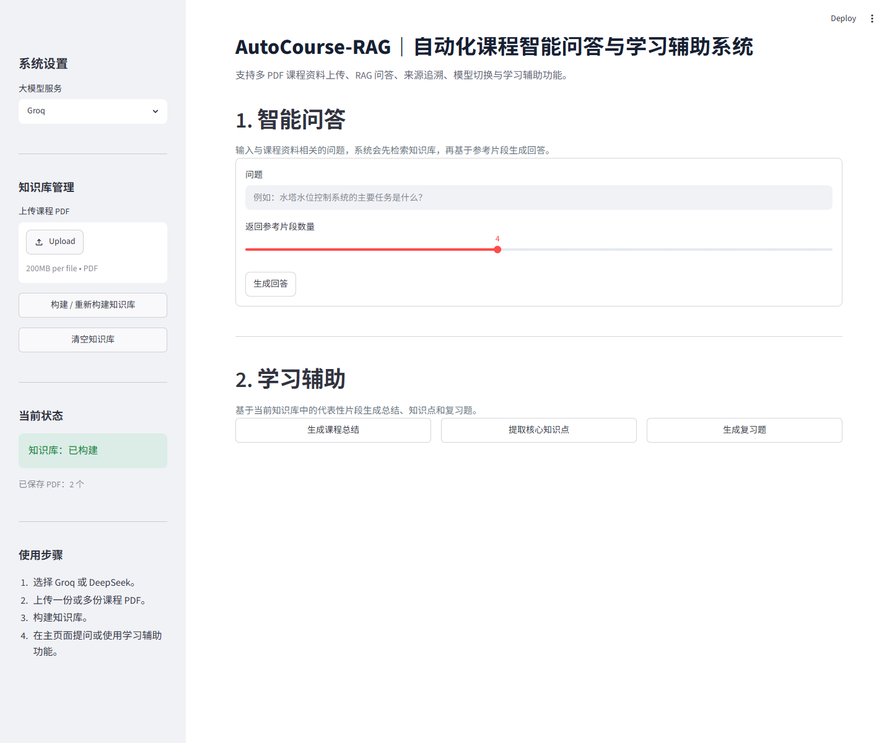
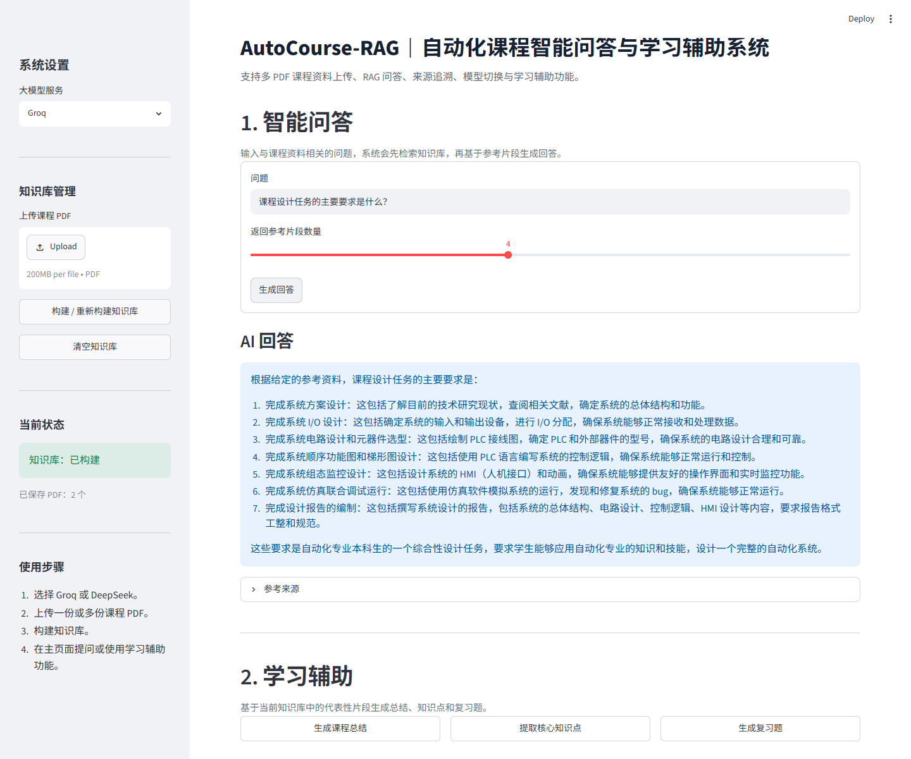
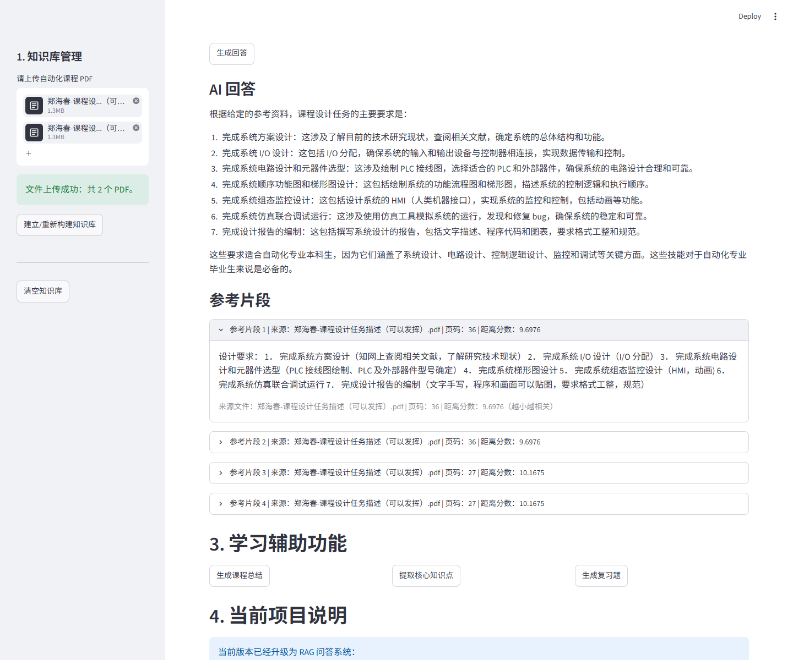
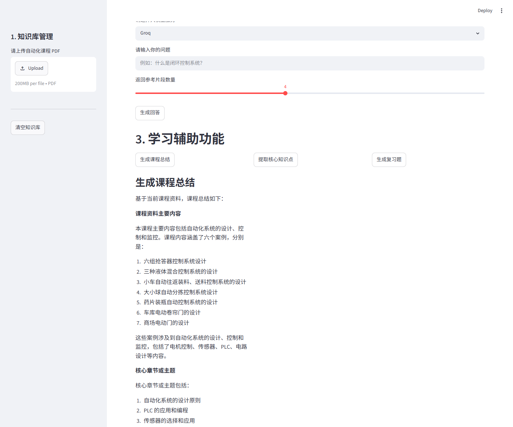
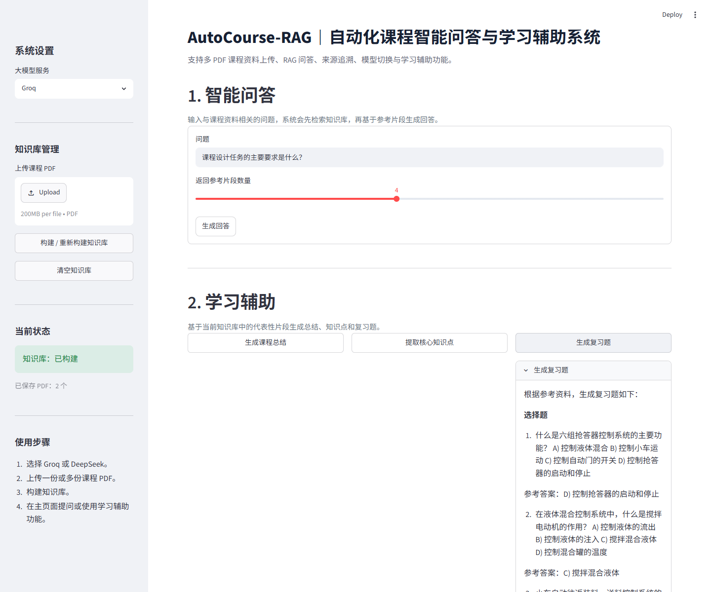

# AutoCourse-RAG：面向自动化课程资料的智能问答与学习辅助系统

## 项目简介

AutoCourse-RAG 是一个面向自动化课程资料的 RAG 智能问答与学习辅助系统。系统支持上传多份课程 PDF，自动构建本地课程知识库，并基于语义检索结果调用大模型生成可追溯的中文回答，同时提供课程总结、核心知识点提取和复习题生成等学习辅助能力。

## 项目背景

自动化专业课程资料通常以 PDF 课件、教材节选、实验指导书等形式存在，内容覆盖自动控制、PLC、传感器、电机控制等多个模块。传统检索方式难以直接定位知识点，大模型直接回答又容易脱离课程资料产生幻觉。

本项目通过 RAG（Retrieval-Augmented Generation，检索增强生成）技术，将课程 PDF 构建为本地向量知识库。用户提问或触发学习辅助功能时，系统先从知识库中检索相关片段，再让大模型基于资料内容生成回答、总结、知识点或复习题，从而提升学习效率、回答准确性和资料可解释性。

## 技术栈

- Python
- Streamlit
- LangChain
- Chroma
- HuggingFace Embeddings
- Groq API
- DeepSeek API
- PyPDF
- OpenAI-compatible API

## 核心功能

- 多 PDF 上传
- 统一知识库构建
- 语义检索
- 来源追溯
- 相似度阈值拒答
- Groq / DeepSeek 模型切换
- 课程总结
- 知识点提取
- 复习题生成
- 知识库清空与重建

## 系统流程

```text
PDF 上传 → 文本解析 → chunk 切分 → Embedding → Chroma 向量库 → 语义检索 → 阈值判断 → 大模型回答 → 来源展示
```

## 项目结构

```text
AutoCourse-RAG/
├── app.py              # Streamlit 页面入口
├── rag_core.py         # PDF 解析、知识库构建、检索和学习辅助逻辑
├── llm_client.py       # Groq / DeepSeek 大模型统一调用封装
├── test_rag_core.py    # 核心逻辑单元测试
├── requirements.txt    # Python 依赖列表
├── README.md           # 项目说明文档
├── .gitignore          # Git 忽略规则
├── screenshots/        # GitHub README 功能截图
├── data/               # 本地上传的 PDF 文件（不提交）
└── vector_db/          # Chroma 向量数据库持久化目录（不提交）
```

## 环境变量配置

在项目根目录创建 `.env` 文件，并配置以下环境变量：

```env
GROQ_API_KEY=你的Groq密钥
DEEPSEEK_API_KEY=你的DeepSeek密钥
```

注意：`.env` 文件包含敏感 API Key，请不要上传到 GitHub 或提交到版本控制系统。

## 安装依赖

```bash
pip install -r requirements.txt
```

## 运行方式

```bash
streamlit run app.py
```

运行后在浏览器中打开 Streamlit 提供的本地地址，即可上传课程 PDF、构建知识库并使用问答与学习辅助功能。

## 项目亮点

- 实现从 PDF 解析、文本切分、向量化、向量库持久化到大模型回答生成的完整 RAG 链路。
- 支持多文档课程知识库构建，适合处理多个章节、课件或实验资料。
- 引入相似度阈值拒答机制，降低大模型在无关问题上的幻觉风险。
- 展示来源文件、页码、距离分数和参考片段，提高回答的可追溯性与可解释性。
- 支持 Groq API 与 DeepSeek API 双模型切换，统一封装大模型调用逻辑。
- 面向自动化课程学习场景，提供课程总结、知识点提取和复习题生成等辅助功能。

## 功能截图

### 多 PDF 上传与知识库管理



### RAG 智能问答



### 来源追溯与距离分数



### 课程总结



### 复习题生成



## 当前不足与后续优化

- 暂未支持扫描版 PDF OCR，当前更适合文字版 PDF。
- 暂未支持用户登录和个人知识库隔离。
- 后续可增加检索效果评估、重排序、知识库管理、多轮对话等功能。
- 可进一步优化代表性 chunk 选择策略，提升总结和复习题生成质量。
- 可增加导出功能，将课程总结、知识点和复习题保存为 Markdown、Word 或 PDF。
