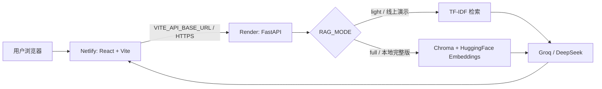
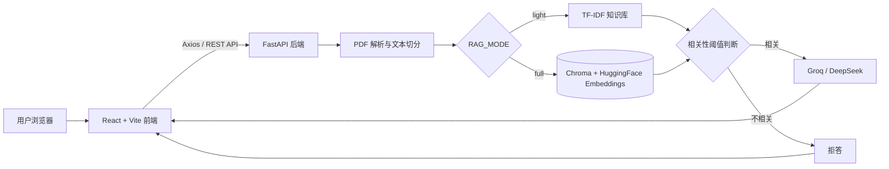

# 基于 RAG 的自动化课程智能学习平台

## 项目简介

基于 RAG 的自动化课程智能学习平台是一个采用 React + FastAPI 前后端分离架构的课程资料 RAG（Retrieval-Augmented Generation）应用。用户可以上传多份自动化课程 PDF，构建本地向量知识库，并通过 Groq 或 DeepSeek 模型完成多轮课程问答、来源追溯、课程总结、知识点提取和复习题生成。

系统将大模型回答限制在课程资料检索结果内，并通过距离阈值拒绝相关性不足的问题，降低脱离资料生成内容的风险。项目同时保留原有 Streamlit 版本，便于对比单体应用与前后端分离架构的实现方式。

## 在线体验

- React 前端（Netlify）：[https://autocourse-rag.netlify.app](https://autocourse-rag.netlify.app/)
- FastAPI 后端（Render）：[https://autocourse-rag-backend.onrender.com](https://autocourse-rag-backend.onrender.com/)
- FastAPI 健康检查（Render）：[https://autocourse-rag-backend.onrender.com/health](https://autocourse-rag-backend.onrender.com/health)
- Swagger API 文档：[https://autocourse-rag-backend.onrender.com/docs](https://autocourse-rag-backend.onrender.com/docs)

> 当前线上服务为免费演示版。Render Free 实例可能休眠，首次访问或首次请求需要等待服务唤醒。

## 在线部署

- React + Vite 前端部署在 Netlify，通过 `VITE_API_BASE_URL` 连接 Render 后端。
- FastAPI 后端部署在 Render，通过 RESTful API 提供 PDF 上传、RAG 问答、学习辅助和知识库重置能力。
- DeepSeek 与 Groq API Key 仅通过后端环境变量管理，不写入前端代码或构建产物。
- 线上演示使用 `RAG_MODE=light`，通过 TF-IDF 完成低内存检索；本地可切换为 `RAG_MODE=full` 使用 Chroma + HuggingFace Embeddings。



## 免费演示版说明

- Render Free 实例可能自动休眠，首次访问时响应速度可能较慢。
- 当前线上后端使用 `RAG_MODE=light`，避免 Chroma、Sentence Transformers 和 PyTorch 超出免费实例内存限制。
- API 限流与模型 Token 配额使用同区域的 Render Free Key Value（Valkey）共享计数；免费实例重启时计数会清空，因此它只承担可丢失的协调状态。
- 当前仍使用 `TASK_QUEUE_BACKEND=memory`。Render Background Worker 没有免费实例，在配置独立 Worker 前不应把任务切到 Redis 队列，否则任务会进入队列但无人消费。
- 未配置 S3 兼容存储时，上传资料、草稿和公共版本仍保存在实例本地目录；Render 临时磁盘不保证长期持久。
- 服务重启或数据丢失后，用户可以重新上传 PDF 并构建知识库。
- 本地完整版仍支持 `RAG_MODE=full`，使用 Chroma + HuggingFace Embeddings 完成向量检索。

## 技术栈

| 层级 | 技术 |
| --- | --- |
| 前端 | HTML、CSS、JavaScript、React、Vite |
| 前端通信 | Axios、FormData、RESTful API |
| 后端 | Python、FastAPI、Uvicorn、Pydantic、CORS |
| RAG 框架 | LangChain、LangChain Community、full / light 双模式 |
| 文档处理 | PyPDF、RecursiveCharacterTextSplitter |
| 检索与向量化 | TF-IDF、scikit-learn、HuggingFace Embeddings、Sentence Transformers |
| 知识库存储 | 轻量内存知识库、Chroma |
| 大模型服务 | Groq API、DeepSeek API、OpenAI-compatible API |
| 共享协调状态 | Redis / Valkey（限流、模型配额、可选任务队列） |
| 测试与评测 | pytest、unittest、FastAPI TestClient、Vitest、Testing Library、离线 RAG 评测 |
| CI/CD 与部署 | GitHub Actions、Netlify、Render Free Web Service |

## 系统架构



## RAG 工作流程

系统在两种运行模式下共用同一套 API、来源结构和拒答流程：

```text
多 PDF 上传
  → PDF 文本解析
  → chunk 切分
  → 根据 RAG_MODE 构建 full 或 light 知识库
  → 校验并裁剪客户端会话历史
  → 保留最近对话、压缩较早历史
  → 将当前追问改写为 standalone_query
  → 使用 standalone_query 检索与排序
  → 距离阈值判断
  → 相关时调用所选模型生成回答
  → 不相关时直接拒答，不调用模型
  → 带 [S1] 编号的回答引用、来源文件、页码、距离分数和参考片段展示
```

课程总结、知识点提取和复习题生成会按上下文预算覆盖全部 chunk：先生成分批中间提要，再合并为整课结果，避免只读取知识库开头的少量片段。

普通访客固定读取 `PUBLIC_KNOWLEDGE_BASE_ID` 指定的公共只读库。管理员浏览器首次访问时会另外生成一个高熵草稿库 ID；PDF、light 索引、Chroma 索引、上传锁和重置操作都按草稿 ID 隔离。上传和清空只能操作草稿，不能直接修改公共库。

上传、重置、发布、版本历史和回滚还必须携带与服务端 `ADMIN_TOKEN` 一致的 `X-Admin-Token`。发布接口会从草稿 PDF 重建公共索引并原子替换上一版公共库；每次成功发布都会保存不可变 PDF 版本包、完整性校验值和活动版本指针。发布或回滚失败时旧公共 PDF、索引和草稿均保持不变。React 只把管理员手动输入的 Token 保存到当前标签页会话的 `sessionStorage`，不会将它写入前端环境变量或静态构建产物。

版本存储默认使用 `backend/public_versions/`，便于本地开发。生产环境可将 `PUBLIC_VERSION_STORAGE_BACKEND` 设置为 `s3`，接入 AWS S3、Cloudflare R2、MinIO 等 S3 兼容对象存储。每个 Web 实例会持续对比远端活动版本与本地已加载版本；Redis Pub/Sub 在发布或回滚后触发快速刷新，定时轮询负责补偿丢失事件。切换在公共库锁内原子完成，进行中的请求继续使用旧版，后续请求使用新版；下载或重建失败时继续服务旧版，并在健康检查中报告版本漂移和降级原因。

知识库构建、发布和回滚采用异步任务接口：管理请求立即返回 `202 Accepted` 和 `job_id`，前端通过受保护的任务状态接口展示解析、建索引、保存草稿和激活版本的进度。本地默认使用进程内 Worker；生产环境应使用 Redis + RQ，使任务在浏览器关闭后继续运行，并让 Web 与 Worker 分离部署。任务输入和已构建草稿同样保存在版本存储中，因此 S3 模式不依赖 Web/Worker 共享本地磁盘。

任务中心会按管理员草稿作用域恢复最近任务，并展示 Worker 健康、状态计数、平均/P95 耗时、执行阶段、失败阶段、重试链和 `trace_id`。失败的草稿构建输入默认保留 24 小时，可直接重试而不必重新上传；成功或过期输入会自动清理。运行中任务超过配置时间没有进度，或 Redis 中没有对应队列的 Worker 时，会标记为异常。

API 限流支持内存和 Redis 两种后端。生产环境使用 Redis 后，所有 Web 实例按“客户端 IP + 知识库 + 接口类型”共享原子计数；模型调用还会按“客户端 IP + 知识库”共享每日 Token 配额和并发槽位。Provider 返回 usage 时按真实 Token 结算，否则保留调用前的保守预留量。普通流量和管理流量可分别配置 Redis 故障时的放行/关闭策略。

草稿构建会按 PDF 内容哈希复用未变化文件的解析 chunk，并为索引生成带 SHA-256、模式和构建指纹的版本化快照。`full` 模式在可用的上一版 Chroma 快照上删除已移除向量、只嵌入变化文件；`light` 模式复用解析结果后重新拟合轻量 TF-IDF。发布直接复用草稿快照，Web 热更新和回滚优先原子加载版本快照；快照缺失、损坏或与当前 `RAG_MODE`、Embedding 模型、切分参数不兼容时自动回退到 PDF 全量重建。

## 多轮对话与上下文压缩

多轮问答采用“客户端保存会话、后端无状态处理上下文”的结构，不依赖 Render 进程内存或服务端全局会话字典：

```text
当前问题
  → 历史格式与长度校验
  → 历史总量裁剪
  → 最近对话窗口与较早历史摘要压缩
  → 上下文字符预算控制
  → standalone_query 独立问题改写
  → full / light RAG 检索
  → 相似度阈值与拒答判断
  → 基于当前问题和本轮检索证据生成回答
  → 返回回答、来源和上下文处理元数据
```

- React 为每个会话生成独立 `conversation_id`，在带版本号的 `localStorage` 结构中保存消息；刷新后可恢复，并支持新建会话和清空当前会话。
- 本地最多保存 8 个会话、每个会话最多 60 条消息；超限时淘汰最旧记录，历史来源只保留文件、页码和分数，不保存来源正文。
- 后端最多接收 80 条历史，默认处理最近 40 条；最近原文窗口硬性限制为 6 条。默认将更早历史压缩为摘要；禁用压缩时直接舍弃更早原文，不扩大最近窗口。
- 上下文默认最多 12000 字符，压缩阈值为 6000 字符；较早历史先受摘要输入预算约束，超过阈值时使用生产摘要器，否则使用确定性压缩。超出最终预算时先缩短摘要，再从最早的保留消息开始裁剪，当前问题始终保留。
- Summarizer 和 Query Rewriter 生产实现复用当前 Groq / DeepSeek Provider。摘要或改写失败时使用确定性降级，不会令问答接口返回 500。
- `standalone_query` 只用于本轮检索；最终回答仍针对当前问题，来源只取自本轮检索结果，历史助手回答不能替代知识库证据。
- full 与 light 模式共用该流程，原有来源追踪、相关性阈值和拒答机制保持不变。
- 自动化测试使用 Fake Summarizer、Fake Query Rewriter、Mock 检索器和固定离线资料，不依赖外部模型或网络。

## full / light 双模式

| 模式 | 检索实现 | 知识库存储 | 适用环境 |
| --- | --- | --- | --- |
| `full` | HuggingFace Embeddings + Chroma 向量语义检索 | `backend/vector_db/<knowledge_base_id>/` | 本地资源较充足、需要完整语义检索的环境 |
| `light` | TF-IDF + scikit-learn 余弦相似度检索 | 内存热索引 + `backend/light_indexes/` JSON 恢复数据 | Render 免费实例等低内存环境 |

`light` 是完整的低内存运行模式，不是简化演示：它保留多 PDF 知识库、RAG 问答、来源追溯、相关性拒答和学习辅助功能。后端默认使用 `light`；设置 `RAG_MODE=full` 后切换到 Chroma 与 HuggingFace Embeddings。

## 核心功能

- 支持一次上传多份 PDF，并统一构建课程知识库。
- 支持“管理员草稿 → 原子发布 → 访客公共只读”的内容发布流程。
- 每次发布生成不可变版本，支持版本历史、SHA-256 完整性校验、启动恢复和一键回滚。
- 多个 Web 实例通过 Redis 变更事件与活动版本轮询自动热更新，并暴露远端/本地版本一致性。
- 草稿构建、发布和回滚支持后台任务、进度查询、幂等提交和知识库级互斥。
- 支持任务历史恢复、失败输入保留、一键重试、Worker 健康、阶段耗时指标和审计追踪。
- 支持 Redis 多实例共享限流、每日模型 Token 配额、并发槽位和可配置故障降级。
- 支持内容哈希增量构建、版本化索引快照、快速发布/回滚和损坏快照自动回退。
- 上传使用临时目录校验并原子替换；失败时保留上一版知识库，同时限制文件数量、大小、总页数和 chunk 数。
- 不同管理员浏览器使用独立草稿作用域，普通访客共享固定的公共只读知识库。
- 支持连续追问、指代消解、最近历史窗口和较早历史摘要压缩。
- 对每份文档执行文本解析和 chunk 切分，并根据运行模式构建 Chroma 向量库或 TF-IDF 内存知识库。
- `full` 模式使用 Chroma 持久化存储向量，并通过 `similarity_search_with_score` 完成语义检索。
- `light` 模式使用 TF-IDF 与余弦相似度完成低内存检索。
- 回答使用 `[S1]`、`[S2]` 引用，并返回对应来源文件、页码、距离分数和参考片段。
- 根据当前检索器的距离值执行阈值判断，相关性不足时不调用大模型并直接拒答。
- 支持 Groq / DeepSeek 双模型切换，复用统一的大模型调用封装。
- 基于当前知识库生成课程总结、核心知识点和复习题。
- 支持清空草稿 PDF 和索引，并用发布动作原子替换公共知识库。
- 支持 `full` / `light` 双模式，在本地检索能力和免费云部署资源限制之间进行适配。

## 前端功能

前端使用 Vite + React + JavaScript 构建，采用原生 CSS 实现组件化页面、交互状态展示和基础响应式布局。

- 使用 `Sidebar`、`UploadPanel`、`ChatPanel`、`SourceCard`、`StudyTools` 等组件拆分页面职责。
- 通过 Axios 统一封装健康检查、上传、问答、学习辅助和知识库重置请求。
- 管理 Token 使用密码输入框录入并仅保存在 `sessionStorage`，关闭标签页后需要重新输入；管理员可独立构建、清空草稿、发布公共库，并查看版本历史或一键回滚。
- 支持拖拽或选择多份 PDF，并通过 `FormData` 上传至 FastAPI。
- 支持 Groq / DeepSeek 模型选择和检索片段数量调整。
- 支持多条问答按时间顺序展示，每条回答保留各自来源与可折叠的上下文处理信息。
- 支持本地会话持久化、新建会话、清空当前会话和失败后无重复消息重试。
- 提供任务中心，展示后台进度、失败阶段、Worker 状态、队列指标和重试入口。
- 使用可折叠来源卡片收纳参考内容，避免长文本影响页面浏览。
- 草稿构建和清空不影响访客结果；只有公共发布成功后才刷新状态并清除旧回答。
- 提供桌面双栏、平板和移动端单栏布局，无需引入复杂 UI 框架。

## RAG 评测与自动回归

项目内置完全离线、结果确定的轻量 RAG 回归评测。评测器使用固定的自编自动控制课程资料，仅替换 PDF 文本读取边界，并直接复用生产代码中的 `build_knowledge_base`、`retrieve_docs` 和 `has_relevant_docs`，因此实际覆盖文本分块、TF-IDF 建库、检索排序与相关性拒答逻辑。整个过程不依赖网络、DeepSeek、Groq 或其他外部模型服务。

评测数据包括：

- 5 份课程测试资料，共 10 页、10 个检索 chunk。
- 13 个评测问题：8 个单文档问题、1 个难同义改写问题、2 个跨文档问题、2 个资料外拒答问题。
- 2 个确定性多轮追问：PID 积分项和 PLC 扫描周期输入响应；强制主 Query Rewriter 失败后调用生产 deterministic fallback，再复用生产 light 检索逻辑。
- 20 个 fallback 回归场景，覆盖“其他”等词法边界、合法指代、明确子主题、陌生术语、空历史、多主题歧义和完整问题。
- 每个问题均定义预期来源、预期关键词和是否应拒答。

运行内置评测：

```powershell
.\venv\Scripts\python.exe -m backend.evaluation.run
```

使用按同一 schema 整理的真实课程数据集评测：

```powershell
.\venv\Scripts\python.exe -m backend.evaluation.run --dataset path\to\course-dataset.json
```

报告会同时输出 light 距离阈值的校准候选值。生产阈值应使用真实课程问题、资料外问题和难负例重新校准，再通过 `LIGHT_MAX_RELEVANT_DISTANCE` 配置，不能只依赖内置自编资料。

当前基线：

| 指标 | 实际结果 | 质量门槛 |
| --- | ---: | ---: |
| Hit Rate@1 | `1.000` | 报告指标 |
| Hit Rate@3 | `1.000` | `>= 0.80` |
| MRR | `1.000` | `>= 0.70` |
| 来源元数据完整率 | `1.000` | `>= 1.00` |
| 拒答准确率 | `1.000` | `>= 0.80` |
| 相关性决策准确率 | `1.000` | `>= 0.85` |
| 多轮追问准确率 | `1.000` | `>= 1.00` |
| Deterministic fallback 准确率 | `1.000` | `>= 1.00` |
| 词法边界准确率 | `1.000` | `>= 1.00` |

相同数据集会重复运行并比较来源、页码和距离排序；当前稳定性检查通过，最终质量门槛结果为 `PASS`。任何受门槛约束的指标未达标或重复运行结果不稳定时，评测命令都会返回非零退出码。

## 自动化测试与 GitHub Actions

当前自动回归结果：

- 后端：覆盖 API、多轮上下文、异步任务、幂等提交、草稿隔离、公共只读发布、版本存储、启动恢复、原子回滚、light 恢复、分层学习工具、引用和 RAG 评测。
- 前端：覆盖知识库 ID 持久化、API 作用域、任务轮询、版本历史与回滚、对话、来源引用和主要交互。
- Vite 生产构建：通过。

本地验证命令：

```powershell
# 项目根目录
.\venv\Scripts\python.exe -m compileall -q backend
.\venv\Scripts\python.exe -m pytest backend -q
.\venv\Scripts\python.exe -m backend.evaluation.run

# 前端目录
cd frontend
npm.cmd run test
npm.cmd run build
```

GitHub Actions 在以下场景触发：

- push 到 `main`；
- 创建或更新面向 `main` 的 Pull Request；
- 手动运行 `workflow_dispatch`。

CI 使用并行的 `Backend Tests and RAG Evaluation` 与 `Frontend Tests and Build` 任务，共同覆盖：

1. Python 语法检查；
2. pytest 后端回归测试；
3. 离线 RAG 评测；
4. 前端单元测试；
5. Vite 生产构建。

前端任务先通过 `npm ci` 按锁文件安装依赖，生产构建使用公开的 Render 后端地址。

## API 接口

FastAPI 提供以下接口，默认服务地址为 `http://localhost:8000`，交互式接口文档位于 `/docs`。

所有接口都必须携带 `X-Knowledge-Base-ID` 请求头，格式为 `kb-` 加 16～64 位字母、数字、下划线或连字符。访客问答使用固定公共 ID，管理请求使用浏览器持久化的草稿 ID。`POST /upload`、`POST /reset`、`POST /publish`、`GET /versions`、任务查询和版本回滚接口还必须携带 `X-Admin-Token`；服务端未配置 `ADMIN_TOKEN` 时，这些管理接口会以 `503` 失败关闭。

构建、发布和回滚请求建议携带 8～128 位的 `Idempotency-Key`。相同知识库、任务类型和幂等键会返回原任务，不会重复执行。前端会自动生成该请求头。

后端对健康检查、问答、学习工具、上传、重置、发布、版本列表、回滚和任务查询分别执行固定窗口限流。超过限制时返回 `429 Too Many Requests`、`Retry-After`、`RateLimit-*` 和 `X-RateLimit-*` 响应头。问答和学习接口调用模型后还会返回 `X-Model-Token-Limit`、`X-Model-Token-Remaining`、`X-Model-Token-Reset` 和本次已用 Token。`RATE_LIMIT_BACKEND=redis` 时，API 限流、每日模型配额和模型并发槽位在所有 Web 实例间共享。

| 方法 | 路径 | 说明 | 主要请求数据 |
| --- | --- | --- | --- |
| `GET` | `/health` | 获取服务与公共知识库状态 | 无 |
| `POST` | `/upload` | 保存 PDF 并提交管理员草稿构建任务 | `multipart/form-data`：`files` |
| `POST` | `/ask` | 基于公共库执行上下文处理、检索、阈值判断和问答 | 原字段 `question`、`model_provider`、`top_k`；可选 `conversation_id`、`history`、`context_options` |
| `POST` | `/study/summary` | 生成课程总结 | `model_provider` |
| `POST` | `/study/knowledge-points` | 提取核心知识点 | `model_provider` |
| `POST` | `/study/quiz` | 生成复习题和参考答案 | `model_provider` |
| `POST` | `/reset` | 清空管理员草稿库，不影响公共库 | 无 |
| `POST` | `/publish` | 提交公共知识库发布任务 | 无 |
| `GET` | `/versions` | 获取公共知识库版本历史和当前活动版本 | 无 |
| `POST` | `/versions/{version_id}/rollback` | 提交指定历史版本回滚任务 | 无 |
| `GET` | `/jobs` | 获取任务历史、指标和 Worker 健康 | 查询参数 `limit` |
| `GET` | `/jobs/{job_id}` | 查询任务阶段、进度、耗时、错误和结果 | 无 |
| `POST` | `/jobs/{job_id}/retry` | 重试失败任务并保留审计链 | 无 |

异步管理接口返回示例：

```json
{
  "job_id": "job-0123456789abcdef0123456789abcdef",
  "task_type": "publish",
  "status": "pending",
  "progress": 0,
  "message": "任务等待执行。"
}
```

`POST /ask` 返回示例：

```json
{
  "answer": "基于课程资料生成的回答",
  "sources": [
    {
      "citation_id": "S1",
      "source": "course.pdf",
      "page": 3,
      "score": 0.25,
      "content": "用于生成回答的参考片段"
    }
  ],
  "is_refused": false,
  "conversation_context": {
    "conversation_id": "conversation-example",
    "standalone_query": "PID 控制器中的积分项有什么作用？",
    "history_turn_count": 2,
    "retained_turn_count": 2,
    "compressed_turn_count": 0,
    "was_compressed": false,
    "summary_used": false,
    "estimated_context_size": 120,
    "query_rewrite_status": "rewritten",
    "compression_status": "not_needed",
    "fallback_used": false,
    "context_limit_applied": false
  }
}
```

旧客户端完全不发送多轮字段时仍按原单轮路径运行；原有回答、来源和拒答字段保持不变。`context_options` 默认值为最近 6 条、历史 40 条、上下文 12000 字符、压缩阈值 6000 字符，可在服务端限定范围内调整。

## 项目结构

```text
AutoCourse-RAG/
├── .github/
│   └── workflows/
│       └── ci.yml                  # 后端、评测与前端 CI
├── backend/
│   ├── __init__.py
│   ├── evaluation/
│   │   ├── fixtures/
│   │   │   └── dataset.json        # 固定离线评测资料与问题
│   │   └── run.py                  # 评测指标、门槛与命令入口
│   ├── conversation/
│   │   ├── models.py               # 多轮数据模型与集中限制
│   │   ├── context_manager.py      # 无状态上下文处理编排
│   │   ├── budget.py               # 字符预算估算与裁剪
│   │   ├── summarizer.py           # 生产摘要器与确定性降级
│   │   └── query_rewriter.py       # 独立问题改写与确定性降级
│   ├── main.py                     # FastAPI 应用、请求模型和 REST API
│   ├── rag_core.py                 # full 模式 Chroma 检索
│   ├── light_rag_core.py           # light 模式 TF-IDF 检索
│   ├── learning_content.py         # 全资料分批处理与分层汇总
│   ├── security.py                 # 管理 Token 校验与固定窗口限流
│   ├── model_governance.py         # 每日 Token 配额、并发槽位与降级策略
│   ├── version_store.py            # 本地/S3 版本存储、版本包和活动指针
│   ├── index_snapshot.py           # 索引快照、构建指纹、校验与安全解压
│   ├── version_sync.py             # 多实例活动版本通知、轮询与原子热更新
│   ├── task_queue.py               # 内存/Redis 任务队列、状态和幂等
│   ├── knowledge_tasks.py          # 构建、发布和回滚任务执行器
│   ├── task_worker.py              # RQ Worker 启动入口
│   ├── llm_client.py               # Groq / DeepSeek 统一调用封装
│   ├── test_main.py                # FastAPI 接口测试
│   ├── test_version_store.py       # 本地/S3 版本存储与版本包测试
│   ├── test_version_sync.py        # 双实例收敛、事件失效和失败保旧版测试
│   ├── test_index_snapshot.py      # 文件/目录快照、兼容性和损坏校验测试
│   ├── test_model_governance.py    # Token 结算、并发和故障策略测试
│   ├── test_light_rag_core.py      # light 检索回归测试
│   ├── test_evaluation.py          # 离线评测与质量门槛测试
│   ├── test_conversation_context.py # 上下文、压缩和改写测试
│   ├── test_multiturn_api.py       # 多轮 API 与隔离测试
│   ├── test_multiturn_llm.py       # Prompt 和 Provider 兼容测试
│   ├── requirements.txt            # 轻量模式依赖
│   ├── requirements-full.txt       # full 模式附加依赖
│   └── runtime.txt                 # Render Python 运行版本
├── frontend/
│   ├── src/
│   │   ├── components/
│   │   │   ├── VersionHistory.jsx  # 公共版本历史与回滚
│   │   │   ├── TaskCenter.jsx      # 任务历史、指标、健康和重试
│   │   │   ├── Sidebar.jsx
│   │   │   ├── UploadPanel.jsx
│   │   │   ├── ChatPanel.jsx
│   │   │   ├── ChatPanel.test.jsx
│   │   │   ├── SourceCard.jsx
│   │   │   ├── SourceCard.test.jsx
│   │   │   └── StudyTools.jsx
│   │   ├── api.js                  # Axios 接口封装
│   │   ├── api.test.js
│   │   ├── knowledgeBaseStore.js   # 匿名知识库 ID 持久化
│   │   ├── adminTokenStore.js      # 会话级管理 Token 存储
│   │   ├── conversationStore.js    # 版本化本地会话管理
│   │   ├── conversationStore.test.js
│   │   ├── App.jsx                 # 前端状态管理与页面组合
│   │   ├── App.test.jsx
│   │   ├── main.jsx                # React 入口
│   │   └── styles.css              # 原生 CSS 与响应式样式
│   ├── netlify.toml                # Netlify 构建与发布目录配置
│   ├── package.json
│   └── vite.config.js              # Vite 配置与开发代理
├── app.py                          # 保留的 Streamlit 版本
├── rag_core.py                     # Streamlit 版本 RAG 核心模块
├── llm_client.py                   # Streamlit 版本模型调用模块
├── test_rag_core.py                # Streamlit RAG 核心测试
├── requirements.txt                # Streamlit 版本依赖
├── screenshots/                    # README 功能截图
├── .gitignore
└── README.md
```

运行时会生成以下目录，且不应提交到 Git：

```text
backend/data/          # 按 knowledge_base_id 保存的 PDF
backend/vector_db/     # 按 knowledge_base_id 保存的 Chroma 数据
backend/light_indexes/ # light 模式可恢复索引数据
backend/public_versions/ # 本地任务输入、草稿、公共版本包与活动指针
backend/runtime_state/   # 当前实例的活动版本恢复标记
frontend/node_modules/
frontend/dist/
```

## 环境变量配置

后端环境变量：

```env
GROQ_API_KEY=
DEEPSEEK_API_KEY=
ADMIN_TOKEN=replace-with-a-long-random-secret
PUBLIC_KNOWLEDGE_BASE_ID=kb-public-shared-00000001
PUBLIC_VERSION_STORAGE_BACKEND=local
PUBLIC_VERSION_STORAGE_DIR=
PUBLIC_VERSION_S3_BUCKET=
PUBLIC_VERSION_S3_PREFIX=autocourse-rag/public
PUBLIC_VERSION_S3_ENDPOINT_URL=
PUBLIC_VERSION_S3_REGION=
AWS_ACCESS_KEY_ID=
AWS_SECRET_ACCESS_KEY=
FRONTEND_ORIGIN=http://localhost:5173
RAG_MODE=light
TASK_QUEUE_BACKEND=memory
REDIS_URL=
TASK_QUEUE_NAME=knowledge
TASK_QUEUE_WORKERS=2
TASK_JOB_TIMEOUT_SECONDS=1800
TASK_RETENTION_SECONDS=86400
TASK_INPUT_RETENTION_SECONDS=86400
TASK_STALLED_SECONDS=600
PUBLIC_VERSION_SYNC_INTERVAL_SECONDS=5
PUBLIC_VERSION_EVENT_CHANNEL=autocourse:public-version-changed
RATE_LIMIT_BACKEND=memory
RATE_LIMIT_PUBLIC_FAIL_OPEN=true
RATE_LIMIT_MANAGEMENT_FAIL_OPEN=false
MODEL_REQUEST_TIMEOUT_SECONDS=60
MODEL_MAX_RETRIES=1
MODEL_MAX_OUTPUT_TOKENS=2048
MODEL_DAILY_TOKEN_LIMIT=200000
MODEL_MAX_CONCURRENT_PER_USER=2
MODEL_CONCURRENCY_SLOT_TTL_SECONDS=180
HEALTH_RATE_LIMIT=120
ASK_RATE_LIMIT=30
STUDY_RATE_LIMIT=10
UPLOAD_RATE_LIMIT=5
RESET_RATE_LIMIT=10
PUBLISH_RATE_LIMIT=5
VERSION_LIST_RATE_LIMIT=30
ROLLBACK_RATE_LIMIT=5
JOB_STATUS_RATE_LIMIT=120
JOB_RETRY_RATE_LIMIT=10
LIGHT_MAX_RELEVANT_DISTANCE=0.81
FULL_MAX_RELEVANT_DISTANCE=20.0
MAX_UPLOAD_FILES=10
MAX_UPLOAD_FILE_BYTES=15728640
MAX_UPLOAD_TOTAL_BYTES=41943040
MAX_PDF_PAGES=200
MAX_KNOWLEDGE_BASE_CHUNKS=240
MAX_INDEX_SNAPSHOT_BYTES=536870912
LEARNING_BATCH_CHARS=24000
LEARNING_MAX_BATCHES=8
```

`ASK_RATE_LIMIT`、`HEALTH_RATE_LIMIT` 和 `JOB_STATUS_RATE_LIMIT` 的窗口为 60 秒；学习、上传、重置、发布、版本列表、任务重试和回滚限额的窗口为 1 小时。模型超时和重试配置会同时应用于回答生成、对话摘要与查询改写。前后端的公共知识库 ID 必须一致；前端可通过 `VITE_PUBLIC_KNOWLEDGE_BASE_ID` 覆盖默认值。修改这些环境变量后需要重启或重新构建对应服务。

本地开发保持 `PUBLIC_VERSION_STORAGE_BACKEND=local` 即可；`PUBLIC_VERSION_STORAGE_DIR` 为空时使用 `backend/public_versions/`。Render 等临时磁盘环境应改为 `s3`，并配置 bucket、前缀、endpoint、region 以及标准 AWS 访问密钥。Cloudflare R2 和 MinIO 使用各自的 S3 endpoint；原始 PDF 以 ZIP 版本包持久化，索引在发布、回滚或启动恢复时按当前 RAG 模式重建，避免把特定向量库格式锁死在版本文件中。

本地开发保持 `TASK_QUEUE_BACKEND=memory` 即可。生产环境设置 `TASK_QUEUE_BACKEND=redis` 和 `REDIS_URL`，Web 服务继续使用 Uvicorn，另启一个使用相同代码、环境变量和 S3 配置的 Worker：

```powershell
.\venv\Scripts\python.exe -m backend.task_worker
```

Redis/RQ 保存任务状态、结果、幂等映射和分布式任务锁，默认保留 24 小时；`TASK_JOB_TIMEOUT_SECONDS` 默认 30 分钟。失败构建输入由 `TASK_INPUT_RETENTION_SECONDS` 控制，默认同样保留 24 小时，并在后续上传时清理过期对象。`TASK_STALLED_SECONDS` 控制长时间无进度告警。生产 Web 与 Worker 不共享磁盘时，必须同时启用 S3 版本存储。

多实例部署时，各 Web 和 Worker 必须使用相同的 `PUBLIC_VERSION_EVENT_CHANNEL`，并共享同一个 S3 版本存储（或同一持久卷上的本地版本目录）。Redis 事件只用于缩短更新延迟，共享版本存储中的活动指针仍是权威状态；即使 Pub/Sub 消息丢失，Web 也会按 `PUBLIC_VERSION_SYNC_INTERVAL_SECONDS`（默认 5 秒）重新检查并收敛。公共库 `/health` 响应中的 `version_sync` 会返回 `remote_active_version`、`loaded_version`、同步状态和最近错误；同步失败时 HTTP 仍返回 200，但顶层 `status` 为 `degraded`，旧版本继续可用。

生产多实例应同时设置 `RATE_LIMIT_BACKEND=redis` 和 `REDIS_URL`。普通问答默认在 Redis 故障时 fail-open，避免知识库完全不可用；管理接口默认 fail-closed，避免失去保护后继续执行变更，可分别通过 `RATE_LIMIT_PUBLIC_FAIL_OPEN` 和 `RATE_LIMIT_MANAGEMENT_FAIL_OPEN` 调整。`MODEL_DAILY_TOKEN_LIMIT` 和 `MODEL_MAX_CONCURRENT_PER_USER` 按客户端 IP 与公共知识库组合生效；如果前面有反向代理，应让 Uvicorn 只信任受控代理提供的客户端地址。

索引快照与对应 PDF 版本保存在同一版本目录或 S3 前缀下。`MAX_INDEX_SNAPSHOT_BYTES` 同时限制快照压缩包和解压后的总大小。构建指纹不匹配时不会强行加载旧索引；升级 Embedding 模型、切分参数或快照 schema 后，首次激活会自动从 PDF 重建并生成兼容当前代码的新本地索引。

`RAG_MODE` 可设置为：

- `full`：本地完整版，使用 Chroma + HuggingFace Embeddings。
- `light`：低内存版本，使用 TF-IDF 检索，适合 Render Free 线上演示。

`FRONTEND_ORIGIN` 用于配置 FastAPI CORS 允许的前端来源。需要调用相应模型时，再在后端运行环境中配置对应服务的密钥。

前端环境变量：

```env
VITE_API_BASE_URL=http://localhost:8000
```

本地未配置时，开发环境默认连接 `http://localhost:8000`。Netlify 生产环境通过站点环境变量连接 Render 后端。前端只保存公开的 API 服务地址，不配置 DeepSeek 或 Groq API Key。

## 后端运行方式

建议使用 Python 虚拟环境：

```powershell
py -3.11 -m venv venv
```

安装默认 `light` 模式依赖：

```powershell
.\venv\Scripts\python.exe -m pip install -r backend\requirements.txt
```

本地需要使用 `full` 模式时，再安装完整依赖并设置运行模式：

```powershell
.\venv\Scripts\python.exe -m pip install -r backend\requirements-full.txt
$env:RAG_MODE="full"
```

从项目根目录启动后端：

```powershell
.\venv\Scripts\python.exe -m uvicorn backend.main:app --reload --port 8000
```

启动后可访问：

- 健康检查：`http://localhost:8000/health`
- Swagger API 文档：`http://localhost:8000/docs`

## 前端运行方式

安装 Node.js 依赖：

```powershell
cd frontend
npm.cmd ci
```

启动 React 开发服务器：

```powershell
npm.cmd run dev
```

浏览器访问 `http://localhost:5173`。生产构建命令：

```powershell
npm.cmd run build
```

## 项目截图

以下截图基于 React + FastAPI 版本和 3 份自动控制课程测试资料生成，重点展示 PDF 上传、RAG 问答、来源追溯、学习工具和响应式页面。

### 学习工作台首页


### 多 PDF 上传与知识库管理


### RAG 智能问答


### 来源追溯与距离分数


### 学习辅助


### 移动端响应式布局


## 项目亮点

- **React 组件化开发**：按上传、问答、来源和学习辅助等职责拆分组件，通过 Props 与状态组合完整页面。
- **原生 Web 页面实现**：使用 HTML、CSS 和 JavaScript 完成 PDF 上传、模型选择、问答工作区、来源追溯和学习工具展示，不依赖复杂 UI 框架。
- **前后端分离**：React 通过 Axios 调用 FastAPI RESTful API，接口职责和数据模型清晰。
- **完整 RAG 链路**：覆盖 PDF 解析、chunk 切分、双模式知识库、检索排序、阈值判断和回答生成。
- **无状态多轮 RAG**：客户端携带会话历史，后端完成预算控制、摘要压缩和独立查询改写，在不引入额外基础设施的前提下支持连续追问。
- **多文档知识库**：支持多份课程资料统一建库，并保留每个 chunk 的来源文件和页码信息。
- **可解释与低幻觉设计**：展示检索距离和参考片段，相关性不足时跳过大模型调用并直接拒答。
- **双模型接入**：通过统一客户端封装 Groq 和 OpenAI-compatible DeepSeek API，前端可直接切换模型服务。
- **双模式 RAG 架构**：本地 `full` 模式使用 Chroma + HuggingFace Embeddings，线上 `light` 模式使用 TF-IDF，在保持接口一致的同时适配不同运行资源。
- **离线质量评测**：固定数据集量化检索命中率、排序质量、来源元数据和拒答准确率，并设置自动质量门槛。
- **自动化回归**：GitHub Actions 并行执行后端测试、离线 RAG 评测、前端测试和生产构建。
- **免费云部署适配**：React + Vite 部署到 Netlify，FastAPI 部署到 Render Free，并通过环境变量管理跨域来源、RAG 模式和服务地址。
- **垂直场景落地**：围绕自动控制、PLC、传感器、电机控制等自动化课程资料提供问答和学习辅助能力。
- **新旧架构并存**：保留 Streamlit 实现，同时提供 React + FastAPI 版本，展示从快速原型到前后端分离应用的演进过程。
